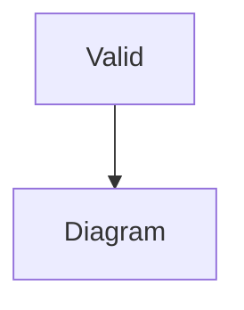
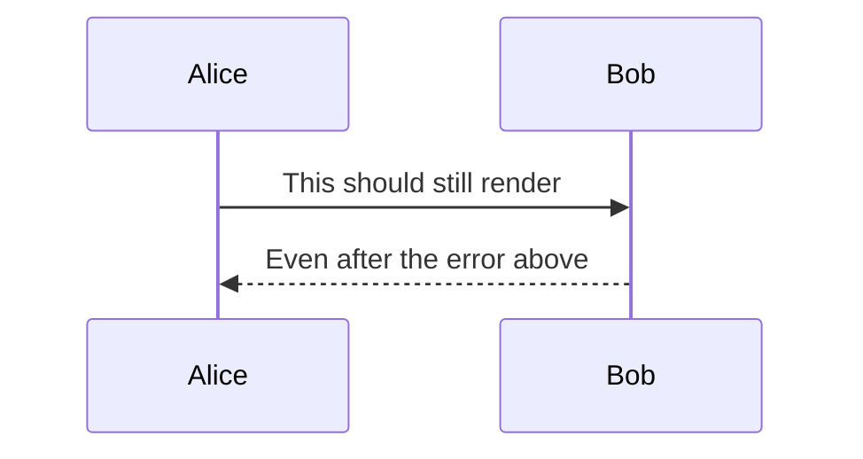

# Chapter with Invalid Mermaid

This chapter contains intentionally invalid Mermaid syntax to test error handling.

## Valid Diagram First



## Invalid Diagram

The following diagram has invalid syntax that should trigger an error:

```mermaid
graph TD
    This is completely invalid syntax!!!
    No arrows, no nothing
    Just random text that mermaid cannot parse
```

## Another Valid Diagram After Error



With `on-error = "comment"`, the build should succeed and the invalid diagram should be replaced with an HTML comment containing error details.