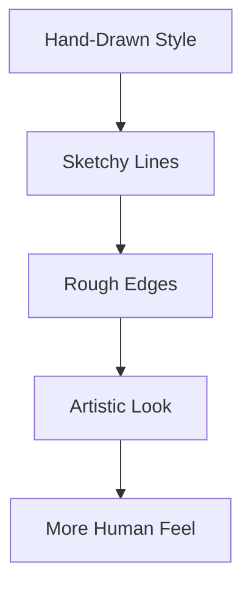
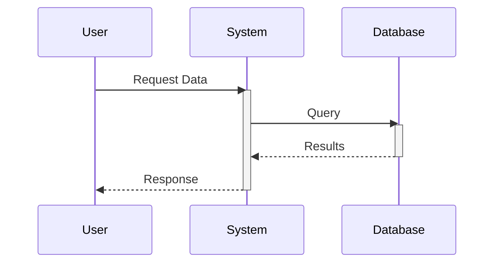
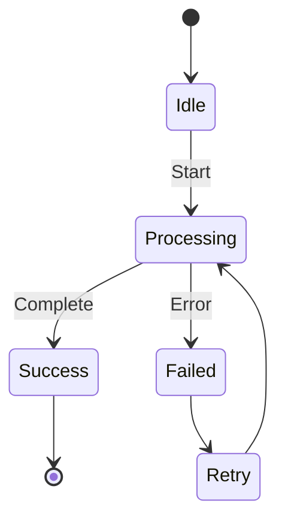

# Hand-Drawn Style

This chapter demonstrates the hand-drawn (sketchy) look configuration.

The diagram above should have a sketchy, hand-drawn appearance with rough edges and imperfect lines, thanks to the `look = "handDrawn"` configuration.

## Sequence Diagram with Hand-Drawn Style

This sequence diagram should also exhibit the hand-drawn aesthetic with sketchy lines and a more organic, less rigid appearance.

## State Diagram

Even state diagrams should show the hand-drawn style, making the entire book's diagrams consistent with this artistic approach.