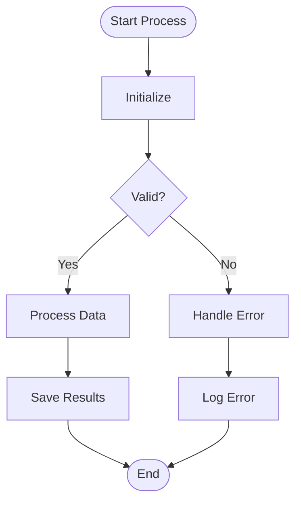
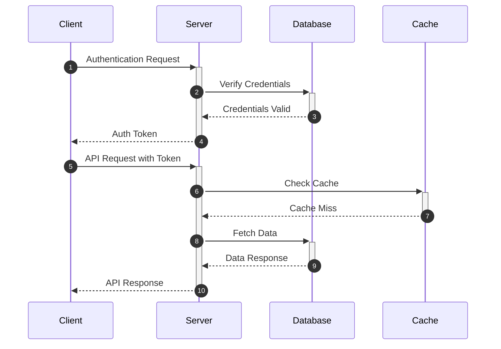
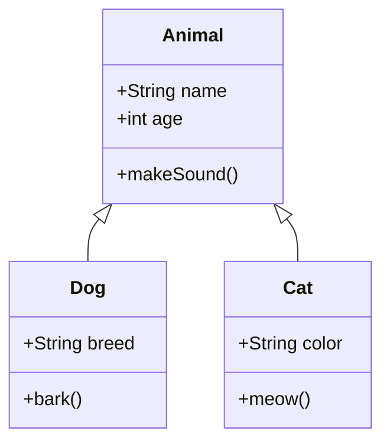
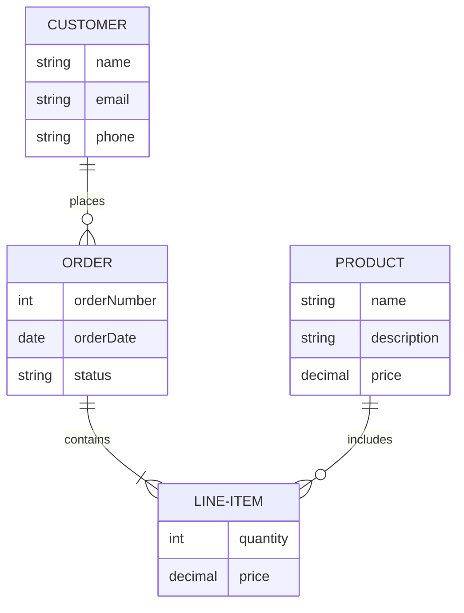
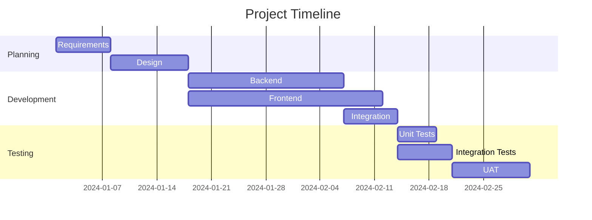

# Multiple Diagrams

This chapter tests multiple Mermaid diagrams on a single page, all rendered with the combined configuration settings.

## Diagram 1: Flowchart

## Diagram 2: Sequence Diagram

## Diagram 3: Class Diagram

## Diagram 4: Entity Relationship

## Diagram 5: Gantt Chart

All five diagrams above should render with:
- Dark theme colors
- Hand-drawn (sketchy) style
- Loose security level
- 45-second timeout
- Error comments (if any fail)

This demonstrates that the configuration is consistently applied across all diagram types on a single page.