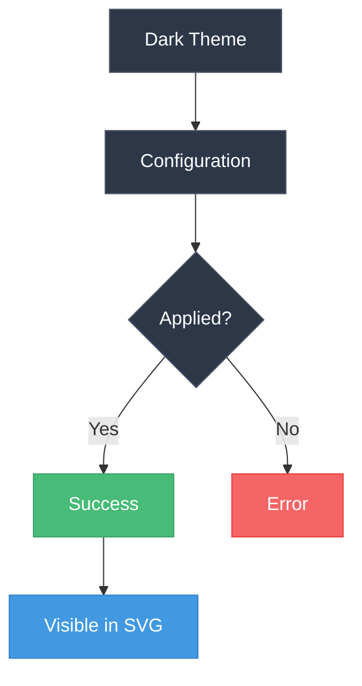
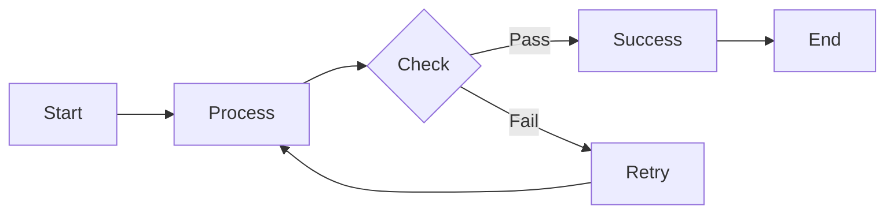

# Dark Theme Diagram

This chapter demonstrates the dark theme configuration.

The diagram above should use dark color schemes. When inspecting the SVG output, you should see dark colors applied to the diagram elements based on the `theme = "dark"` configuration.

## Flowchart Example

This flowchart should also reflect the dark theme colors in the generated SVG.