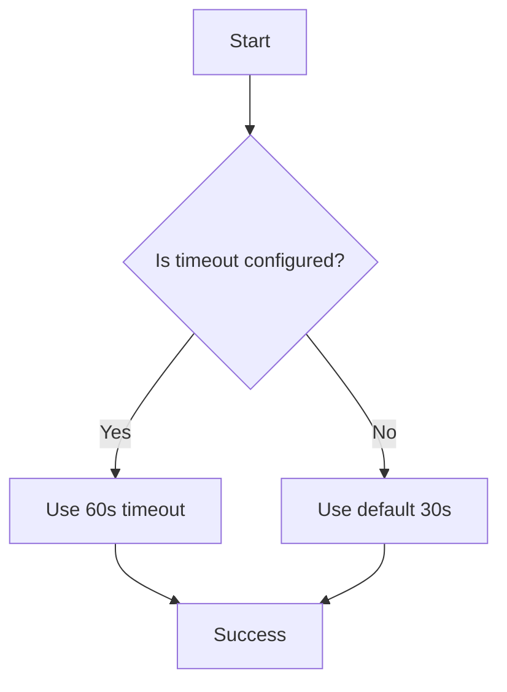

# Chapter with Mermaid

This chapter verifies that the custom timeout configuration is applied.

```mermaid
graph TD
    A[Start] --> B{Is timeout configured?}
    B -->|Yes| C[Use 60s timeout]
    B -->|No| D[Use default 30s]
    C --> E[Success]
    D --> E
```

The diagram above should render successfully with the configured 60-second timeout.