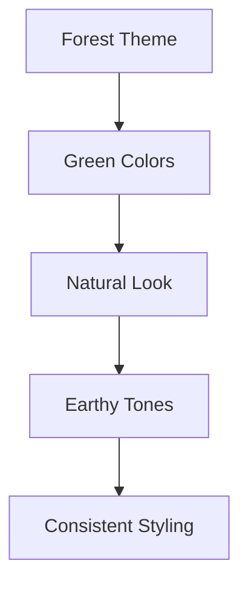
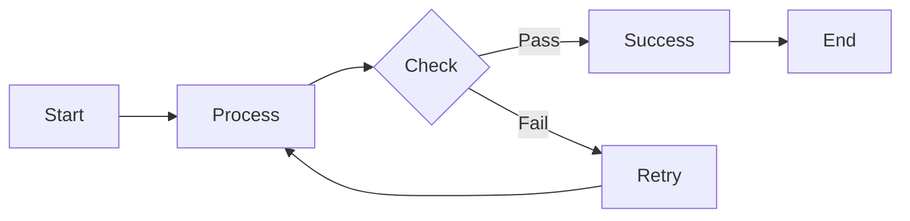

# Forest Theme Diagram

This chapter demonstrates the forest theme configuration with green-tinted color schemes.

The diagram above should use the forest theme's characteristic green color palette.

## Another Diagram

This flowchart should also reflect the forest theme colors in the generated SVG.